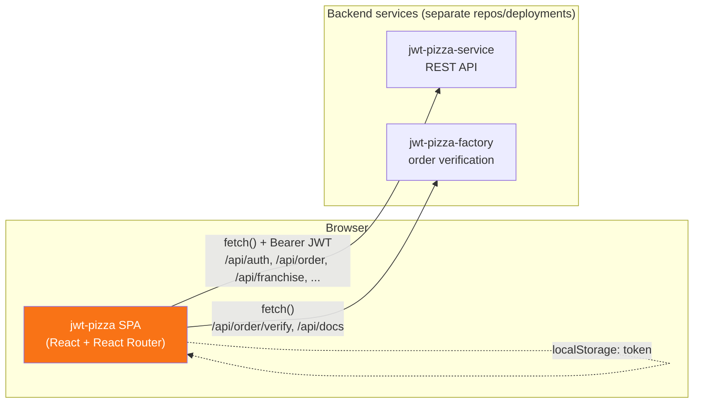
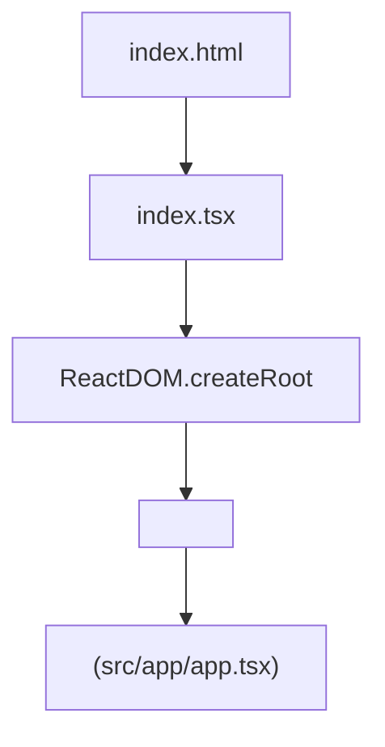
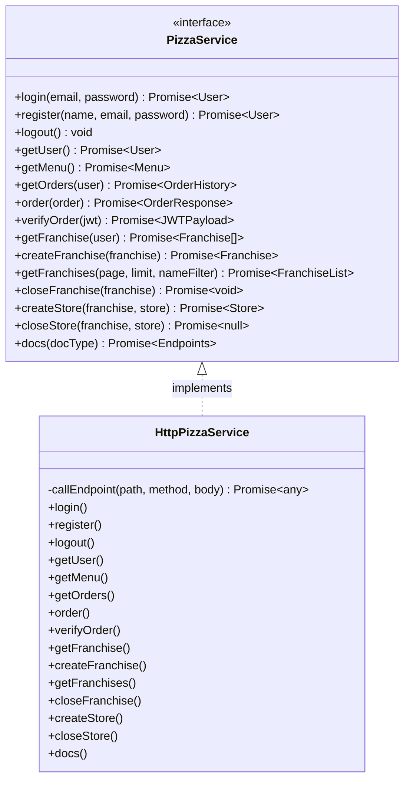
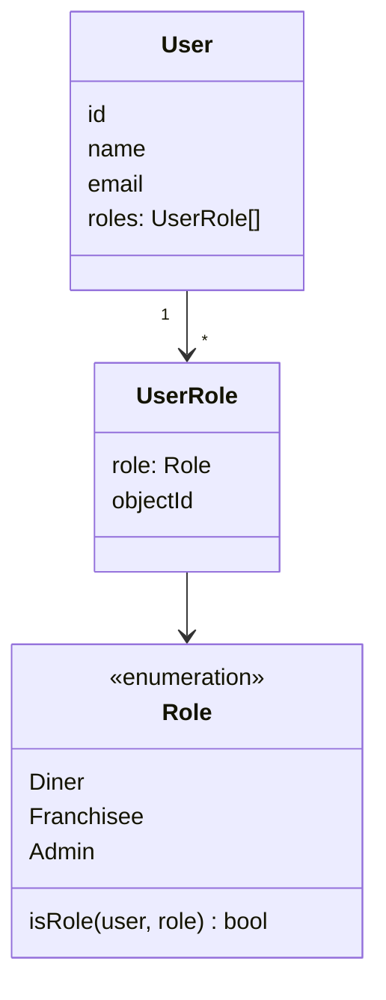
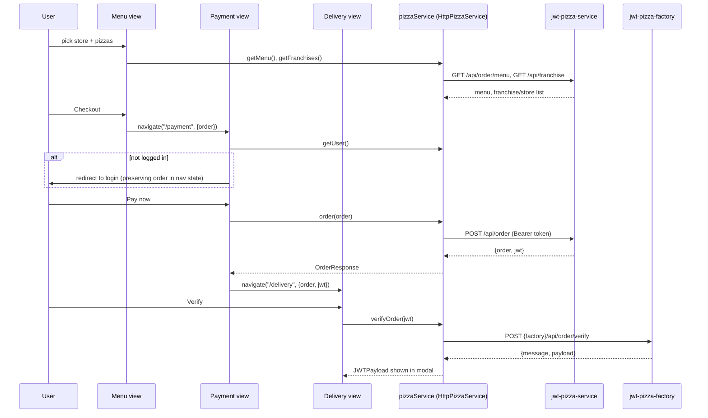
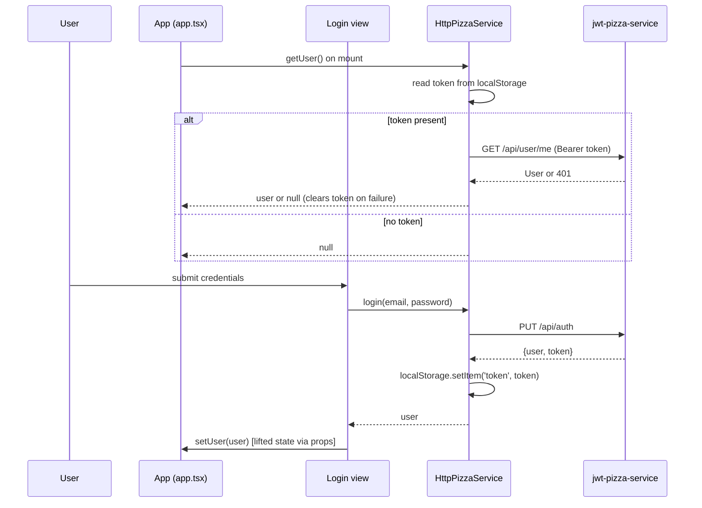

# JWT Pizza — Architecture Overview

Welcome! This document explains how the `jwt-pizza` codebase works, from the browser down to the network calls it makes. It's meant to get a new engineer productive quickly, without having to reverse-engineer the whole app first.

## 1. What this repository is

`jwt-pizza` is the **frontend only**. It is a single-page application (SPA) built with **React + TypeScript**, bundled by **Vite**, styled with **Tailwind CSS** and the **Preline** component library.

This app does not contain any backend logic, database, or authentication server — it is a pure client that talks to a separate backend service over HTTPS. Two backend services are involved, both configured via environment variables and both outside this repo:

| Service | Env var | Purpose |
|---|---|---|
| **jwt-pizza-service** | `VITE_PIZZA_SERVICE_URL` | The core API: auth, users, menu, orders, franchises, stores |
| **jwt-pizza-factory** | `VITE_PIZZA_FACTORY_URL` | A third-party-style service that "makes" the pizza and can verify the JWT stamped on an order |

Locally, `.env.development` points the service URL at `http://localhost:3000` (you're expected to run `jwt-pizza-service` locally alongside this app). In production (`.env.production`), it points at the hosted service at `pizza-service.cs329.click`.

This is a course project (CS 329) that doubles as a teaching example for JWTs, so a lot of the UI (the "Delivery" screen in particular) exists specifically to show the JWT that was issued for an order and let you verify it against the factory service.

## 2. High-level architecture



Key point: **all state lives in the browser.** There's no server-rendering, no session store on this side — auth state is a JWT kept in `localStorage`, and application data (menu, franchises, orders) is fetched fresh from the API as views mount.

## 3. Entry point and bootstrapping



- [index.html](index.html) loads [index.tsx](index.tsx), which mounts `<App />` inside a `BrowserRouter`.
- [src/app/app.tsx](src/app/app.tsx) is the composition root. On mount it:
  1. Calls `pizzaService.getUser()` to see if a token in `localStorage` is still valid, and sets React state accordingly.
  2. Defines a single array, `navItems`, that is simultaneously the **route table**, the **nav bar menu**, and the **footer menu** — each entry has a `to` path, a `component`, a `display` list (`'nav'`, `'footer'`, or neither), and optional `constraints` (functions like `isAdmin`, `loggedIn`) that gate visibility.
  3. Renders `<Header>`, a `<Breadcrumb>`, a `<Routes>` block generated from `navItems`, and `<Footer>`.

This "one array drives routes + nav + footer" pattern is the main thing to understand before touching navigation — adding a page means adding one entry to `navItems`, not editing three separate files.

## 4. Directory layout

```
index.html, index.tsx          → app bootstrap
src/
  app/
    app.tsx                    → root component, route table, auth state
    header.tsx, footer.tsx     → chrome, driven by navItems
  components/                  → small reusable presentational pieces
    button.tsx, card.tsx, carousel.tsx, quote.tsx, slide.tsx, breadcrumb.tsx
  hooks/
    appNavigation.tsx          → useBreadcrumb() "go to parent route" helper
  views/                       → one file per route/page (see §6)
  service/
    pizzaService.ts            → types + PizzaService interface (the contract)
    httpPizzaService.ts        → concrete implementation (fetch-based)
    service.ts                 → wires the interface to the implementation
  icons.tsx                    → inline SVG icon components
```

## 5. The service layer (how the app talks to the backend)

This is the most important abstraction in the codebase. All backend I/O is funneled through a single `PizzaService` interface, so views never call `fetch` directly.



- [src/service/pizzaService.ts](src/service/pizzaService.ts) defines every domain type (`User`, `Menu`, `Pizza`, `Order`, `Franchise`, `Store`, `Role`, ...) and the `PizzaService` interface. This is the contract views code against.
- [src/service/httpPizzaService.ts](src/service/httpPizzaService.ts) is the only implementation today. Its private `callEndpoint(path, method, body)` helper:
  - Prefixes relative paths with `VITE_PIZZA_SERVICE_URL` (absolute URLs, like factory calls, pass through unchanged).
  - Attaches `Authorization: Bearer <token>` from `localStorage.getItem('token')` when present.
  - Sends `credentials: 'include'` and JSON bodies.
  - Resolves with parsed JSON on `r.ok`, otherwise rejects with `{ code, message }`.
  - `login`/`register` store the returned token in `localStorage`; `logout` clears it.
- [src/service/service.ts](src/service/service.ts) is the composition point: `const pizzaService: PizzaService = httpPizzaService`. Views import `pizzaService` from here, never `httpPizzaService` directly.

**Why this matters:** because everything goes through the `PizzaService` interface, swapping in a mock implementation (for tests, or a Storybook-style dev mode) is a one-line change in `service.ts`. If you're adding a new API call, add it to the interface first, then implement it in `HttpPizzaService`.

### Backend endpoints referenced by this app

Derived from `httpPizzaService.ts` — this is effectively the API surface this SPA depends on:

| Method | Path | Used for |
|---|---|---|
| PUT | `/api/auth` | login |
| POST | `/api/auth` | register |
| DELETE | `/api/auth` | logout |
| GET | `/api/user/me` | get current user from token |
| GET | `/api/order/menu` | pizza menu |
| GET | `/api/order` | order history |
| POST | `/api/order` | place an order (returns order + signed JWT) |
| POST | `{factory}/api/order/verify` | verify an order's JWT |
| GET | `/api/franchise/:userId` | franchises owned by a user |
| POST | `/api/franchise` | create a franchise (admin) |
| GET | `/api/franchise?page&limit&name` | paged/filterable franchise list |
| DELETE | `/api/franchise/:id` | close a franchise |
| POST | `/api/franchise/:id/store` | create a store |
| DELETE | `/api/franchise/:id/store/:id` | close a store |
| GET | `/api/docs` and `{factory}/api/docs` | self-describing API docs, rendered by the Docs page |

The live version of these docs is also viewable at runtime via the **Docs** page (`/docs/:docType?`), which calls `pizzaService.docs()` and renders whatever the backend reports about itself.

## 6. Routing, roles, and page inventory

Routing is React Router v6, entirely data-driven from the `navItems` array in `app.tsx` (see §3). Route params use the `:subPath?` trick so the same page (e.g. login, create-store) can be reached from multiple parent contexts and still know where "back" should go, via `useBreadcrumb()` ([src/hooks/appNavigation.tsx](src/hooks/appNavigation.tsx)).

There are three roles, defined in `pizzaService.ts`:



A user's `roles` array can contain multiple entries (e.g. a franchisee tied to a specific franchise `objectId`). `Role.isRole(user, role)` is the single check used everywhere (see `isAdmin()`/`isNotAdmin()` in `app.tsx`, and the guard in `AdminDashboard`).

Page inventory (`src/views/*.tsx`):

| View | Route | Notes |
|---|---|---|
| [home.tsx](src/views/home.tsx) | `/` | Landing page |
| [menu.tsx](src/views/menu.tsx) | `/menu` | Pick a store + pizzas, builds an `Order` client-side |
| [payment.tsx](src/views/payment.tsx) | `/payment` | Redirects to login if no user; submits the order |
| [delivery.tsx](src/views/delivery.tsx) | `/delivery` | Shows the returned JWT; "Verify" calls the factory service |
| [login.tsx](src/views/login.tsx) / [register.tsx](src/views/register.tsx) | `/:subPath?/login`, `/:subPath?/register` | Reusable at any nesting level |
| [logout.tsx](src/views/logout.tsx) | `/:subPath?/logout` | Clears token, updates `user` state |
| [dinerDashboard.tsx](src/views/dinerDashboard.tsx) | `/diner-dashboard` | Order history for the logged-in diner |
| [franchiseDashboard.tsx](src/views/franchiseDashboard.tsx) | `/franchise-dashboard` | Franchisee's stores + revenue, or a marketing pitch if you're not one yet |
| [createStore.tsx](src/views/createStore.tsx) / [closeStore.tsx](src/views/closeStore.tsx) | nested under dashboards | Store CRUD |
| [createFranchise.tsx](src/views/createFranchise.tsx) / [closeFranchise.tsx](src/views/closeFranchise.tsx) | nested under dashboards | Franchise CRUD (admin) |
| [adminDashboard.tsx](src/views/adminDashboard.tsx) | `/admin-dashboard` | Admin-only (guarded via `Role.isRole`); paged/filterable franchise + store management |
| [about.tsx](src/views/about.tsx) | `/about` | Static content |
| [history.tsx](src/views/history.tsx) | `/history` | Static content |
| [docs.tsx](src/views/docs.tsx) | `/docs/:docType?` | Renders live API docs from the service or factory |
| [notFound.tsx](src/views/notFound.tsx) | `*` | Catch-all |

`view.tsx` is a shared layout wrapper (title + centered content) used by most pages, not a route itself.

## 7. Core user flow: ordering a pizza

This is the flow most tightly bound to the JWT theme of the app and worth understanding end-to-end.



Notes on this flow:
- The in-progress `Order` object is passed between routes via React Router's navigation **state** (`navigate(path, { state })`), not global state or a store — so refreshing the page loses the in-progress order. This is intentional simplicity, not an oversight.
- `payment.tsx` checks auth *after* the order is built, so an anonymous user can browse the menu and only has to log in at checkout — the pending order survives the login redirect because `location.state` is threaded through.
- The JWT returned from placing an order is opaque to this app until the user clicks "Verify," which round-trips it to the **factory** service (a separate authority) to decode/validate it — this is the pedagogical core of the app: the frontend never validates the JWT itself, it just displays it and asks a service to check it.

## 8. Authentication



- There is no auth context/provider — `user` is `useState` owned by `App` and passed down as a prop (`Login`, `Register`, `Logout`, `DinerDashboard`, `FranchiseDashboard`, `AdminDashboard` all receive `user` or `setUser` directly). If you need `user` deeper in the tree, thread it through props following the existing pattern, or consider introducing context — there isn't one today.
- The token itself is a plain string in `localStorage` under the key `token`. Every `HttpPizzaService` call reads it fresh, so there's no in-memory caching to go stale.
- `getUser()` self-heals: if the stored token is rejected by `/api/user/me`, it removes the token from `localStorage` so the app naturally falls back to "logged out" on next render.

## 9. UI building blocks

- [components/button.tsx](src/components/button.tsx), [card.tsx](src/components/card.tsx), [carousel.tsx](src/components/carousel.tsx), [quote.tsx](src/components/quote.tsx), [slide.tsx](src/components/slide.tsx), [breadcrumb.tsx](src/components/breadcrumb.tsx) — small, mostly presentational, no service calls.
- Styling is Tailwind utility classes directly in JSX (no CSS modules/styled-components). [main.css](main.css) just pulls in Tailwind's base/components/utilities layers; [tailwind.config.js](tailwind.config.js) wires in the Preline plugin.
- **Preline** (`import 'preline/preline'`) provides the interactive bits that aren't plain React — collapsible nav, tooltips, modals/overlays (see the JWT verification modal in `delivery.tsx`, driven by `HSOverlay.open(...)`). Because Preline manipulates the DOM outside React's control based on `data-hs-*` attributes, `app.tsx` calls `window.HSStaticMethods.autoInit()` on every route change to re-scan and re-initialize those widgets.
- Icons in [icons.tsx](src/icons.tsx) are inline SVG React components (HeroIcons), not an icon font/library dependency.

## 10. Build, environments, and deployment

- **Vite** is the build tool (`npm run dev`, `npm run build`, `npm run preview` — see [package.json](package.json)).
- Environment variables are loaded by Vite's standard `.env.[mode]` convention:
  - [.env.development](.env.development) — local dev, expects `jwt-pizza-service` running on `localhost:3000`.
  - [.env.production](.env.production) — points at the hosted course infrastructure (`*.cs329.click`).
- [deployService.sh](deployService.sh) is the deployment script: runs `npm run build`, stamps `dist/version.json` with a timestamp, then `ssh`/`scp`s the `dist/` output to an EC2-style Ubuntu host (`ubuntu@<hostname>`) under `public_html/jwt-pizza`, wiping any prior deployment first. There is no CI/CD pipeline defined in this repo (no `.github/workflows`) — deployment is manual/scripted, invoked as `./deployService.sh -k <pem-key> -h <hostname>`.
- `public/version.json` is the runtime-visible build stamp the deploy script updates; useful for confirming which build is live.

## 11. Things a new engineer should know going in

- **This repo has no backend.** If something looks broken in "data," check whether `jwt-pizza-service` is running locally (dev) and reachable, before debugging this codebase.
- **`navItems` in `app.tsx` is the source of truth for routes, nav, and footer.** Don't add a `<Route>` by hand elsewhere.
- **All backend calls go through `pizzaService`** (`src/service/service.ts`). Don't call `fetch` directly from a view — extend `PizzaService`/`HttpPizzaService` instead.
- **Auth state is prop-drilled from `App`**, not context — expect to see `user`/`setUser` passed down explicitly.
- **In-flight order/franchise/store objects travel via router `state`**, not a global store — refreshing mid-flow drops them by design.
- **Role checks always go through `Role.isRole(user, role)`** — don't inline `user.roles.find(...)` elsewhere.
